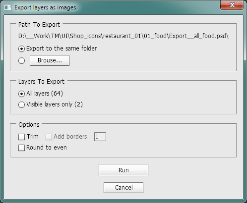

# Photoshop Export Layers to PNG Faster
This script exports layers of your Photoshop document as separate PNG files very fast.

## Features
1. Export all layers or visible only
2. Select the export path or use default (near you PS document)
3. Trim layers
4. Add trasparent borders
5. Round the canvas size to even value
## How To
1. Download `Export Layers As PNG.jsx`
2. Run script (double click from Explorer/Finder)
